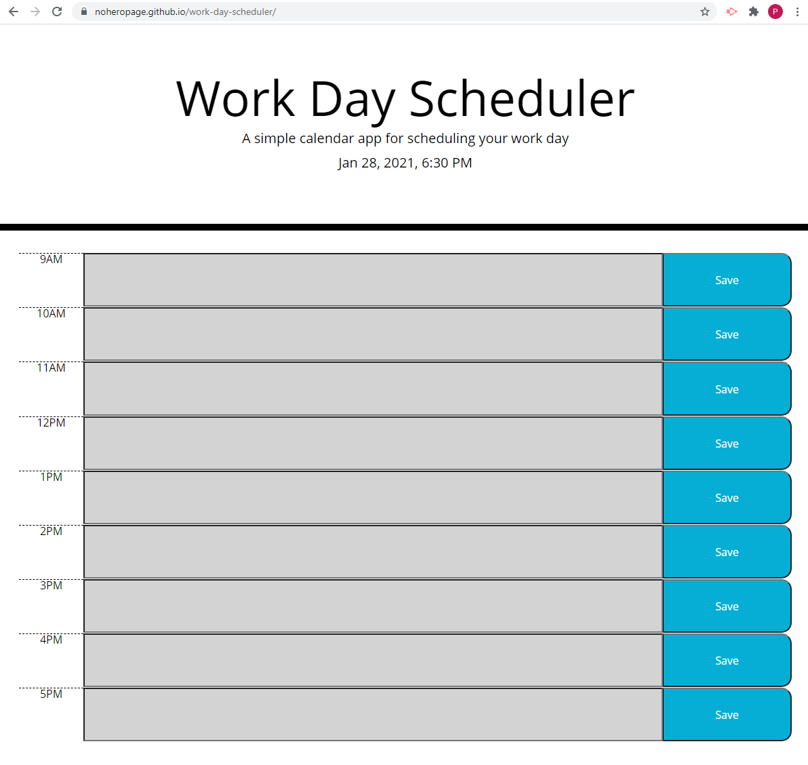

# Work-Day-Scheduler

## Description
Website allows the user to input and save tasks corresponding with the various hours of a typical 9-5 workday with the help of the luxon api. The date and time are displayed at top. If the website is loaded during the hours displayed the site will update the colors of the input field so the user can tell if the particular time block is past, present, or future. After entering text and hitting the save button a user can leave or refresh the page and keep the input data. If the user returns to the website on a new day the site will present empty input fields. 

## Screenshot

## Link
https://noheropage.github.io/work-day-scheduler/